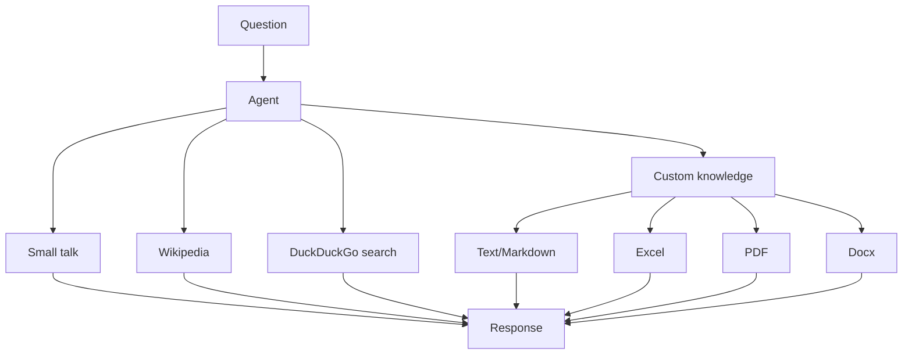

# Cornucopia

A LLM powered knowledge assistant.

---



### Usage

```sh
pip install -r requirements.txt
```

Run the API server

```sh
uvicorn app.main:app --host 0.0.0.0 --port 8080 --reload 
```

Set API url in frontend [chat.js](./frontend/js/chat.js) and visit `localhost`