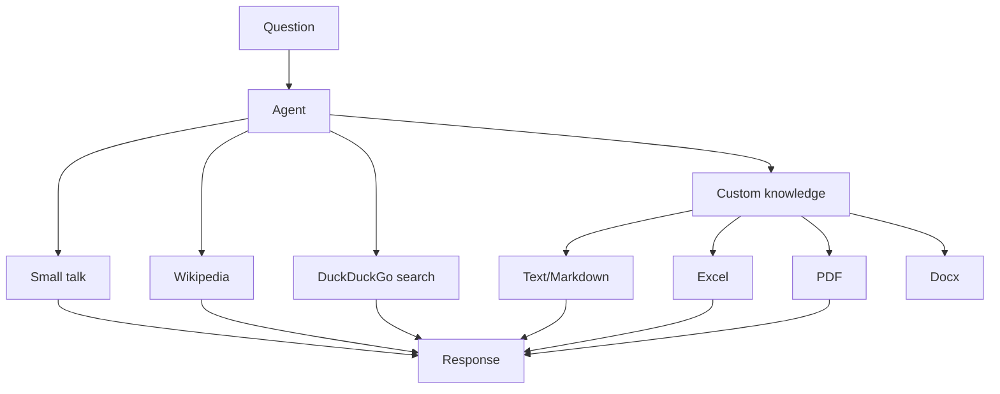

# Cornucopia

A LLM powered knowledge assistant.

---

```mermaid
graph TD
  A["Question"]-->B["Agent"]
  B-->C["Small talk"]
  B-->D["Wikipedia"]
  B-->E["Custom knowledge"]
  B-->F["DuckDuckGo search"]
  C-->G["Response"]
  D-->G
  E-->H["Text/Markdown"]
  E-->I["Excel"]
  E-->J["PDF"]
  E-->K["Docx"]
  F-->G
  H-->G
  I-->G
  J-->G

```